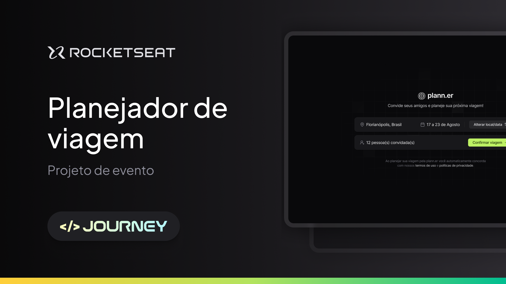

# plann.er

Projeto desenvolvido durante o NLW Journey da [Rocketseat](https://app.rocketseat.com.br/) que consiste em um site desktop para montar planos de viagem com amigos, registrar atividades e links úteis.



## Índice

- [Ferramentas](#ferramentas)
- [Instalação](#instalação)
- [Funcionalidade](#funcionalidades)
- [Projeto](#projeto)
- [Layout](#layout)
- [Licença](#licença)

## Ferramentas

- **React**: Biblioteca para construção da interface do usuário (`react` e `react-dom`).
- **React Router**: Gerenciamento de rotas no aplicativo (`react-router-dom`).
- **Axios**: Requisições HTTP (`axios`).
- **Date-fns**: Manipulação e formatação de datas (`date-fns`).
- **LocalForage**: Armazenamento de dados offline (`localforage`).
- **Lucide React**: Conjunto de ícones para React (`lucide-react`).
- **React Day Picker**: Componente para seleção de datas (`react-day-picker`).
- **Sonner**: Biblioteca para criar notificações (`sonner`).
- **Sort-by**: Função para ordenar arrays (`sort-by`).
- **Tailwind Variants**: Utilitário para criar variantes de estilos com Tailwind CSS (`tailwind-variants`).
- **Zod**: Biblioteca para validação de esquemas (`zod`).
- **Match Sorter**: Função para ordenar e filtrar listas (`match-sorter`).

## Instalação

Siga as etapas abaixo para configurar e instalar o plann.er em seu ambiente local:

1. Clone o repositório e acesse o diretório:

```bash
git clone git@github.com:brunohnsouza/nlw-journey-react.git
cd nlw-journey-react
```

2. Instale as dependências do projeto:

```bash
npm install
```

3. Inicie o servidor em modo de desenvolvimento:

```bash
npm run dev
```

Acesse http://localhost:5173 para visualizar a aplicação.

## Funcionalidades

O projeto oferece as seguintes funcionalidades:

- **Planejamento de Viagens**: Crie e gerencie planos de viagem colaborativos com amigos.
- **Registro de Atividades**: Adicione e acompanhe atividades planejadas durante a viagem.
- **Links Úteis**: Armazene e acesse links importantes relacionados à sua viagem.
- **Interface Desktop**: Experiência otimizada para visualização e interação em dispositivos desktop.

## Vídeos de Testes

Veja os vídeos demonstrando os testes do front-end:

### Criação de viagem

https://github.com/user-attachments/assets/a1633d45-a9a5-4e7b-8086-8bd25af4ccd6

### Criação de atividade

https://github.com/user-attachments/assets/f39a4343-2260-4f3d-b62e-c2a67119afe7

### Cadastro de link

https://github.com/user-attachments/assets/505c73c8-c295-41cd-bf0f-5b289b055ef0

### Alterando destino e período da viagem

https://github.com/user-attachments/assets/f45e8dca-e761-4950-935b-0ba13347a295

### Algumas validações

https://github.com/user-attachments/assets/e01676ee-2199-4b26-87ce-ff5c1460addc

### Responsividade (tela inicial)

https://github.com/user-attachments/assets/64e17103-95cd-412c-96e5-afda3eccbbf4

### Responsividade (tela detalhes da viagem)

https://github.com/user-attachments/assets/a98abd9b-9ccc-48d4-ae32-e639c18ff270

## Layout

[Figma](https://www.figma.com/community/file/1392276515495389646)

## Licença

[MIT](https://choosealicense.com/licenses/mit/)
